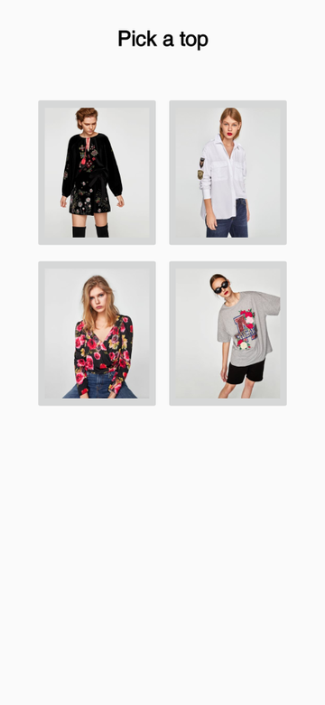
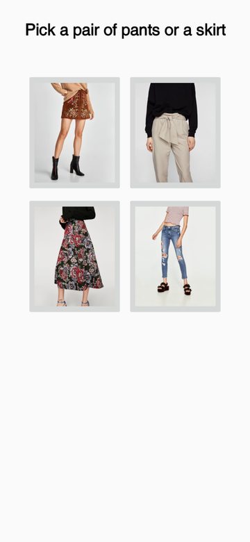
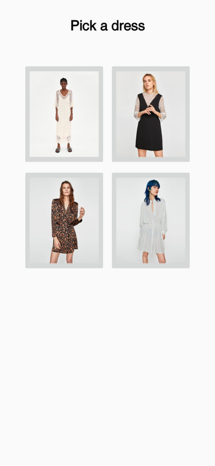
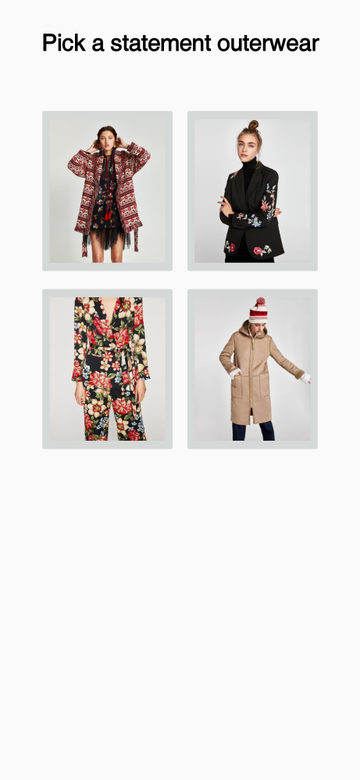
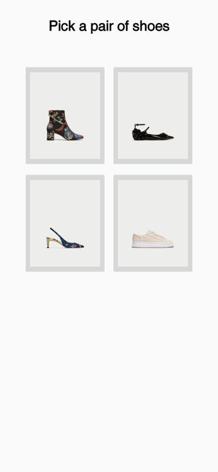
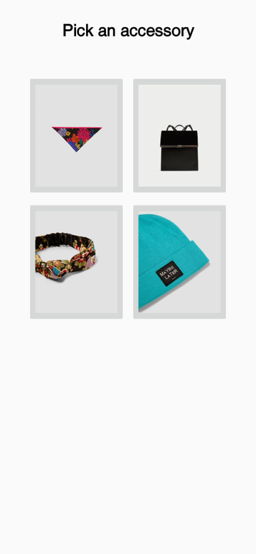

# Zara Fashion: what's your style?

> **Original version:** this README and some fixes were added in 2026. To see the project exactly as it was first built, browse commit [`efe933e`](https://github.com/dianapaula19/zara-fashion-app/tree/efe933e3a28867296a1c08b5addcc14f85f41828) (2020-08-07).

An Android quiz app: pick your favourite top, bottoms, dress, outerwear, shoes and accessory from
six screens of clothing photos, and the app tells you whether your style is **bohemian**,
**casual**, **chic** or **vintage**, and lets you retake the test. Made for my high-school
Computer Science certification exam.

- Java, Android SDK 26 (min SDK 15), one activity per question and a result activity
- Each answer adds a point to one of the four styles; the result screen shows the style with
  the most points

## Screenshots

  
  
  
  

  
  
  

Rendered in 2026 from the app's own layouts with [Paparazzi](https://github.com/cashapp/paparazzi).
The result screens are not shown here because their example photos are of celebrities.

## Try it

A signed build is included: install [`app/release/app-release.apk`](app/release/app-release.apk)
on an Android phone, or open the project in Android Studio and run it on an emulator.
